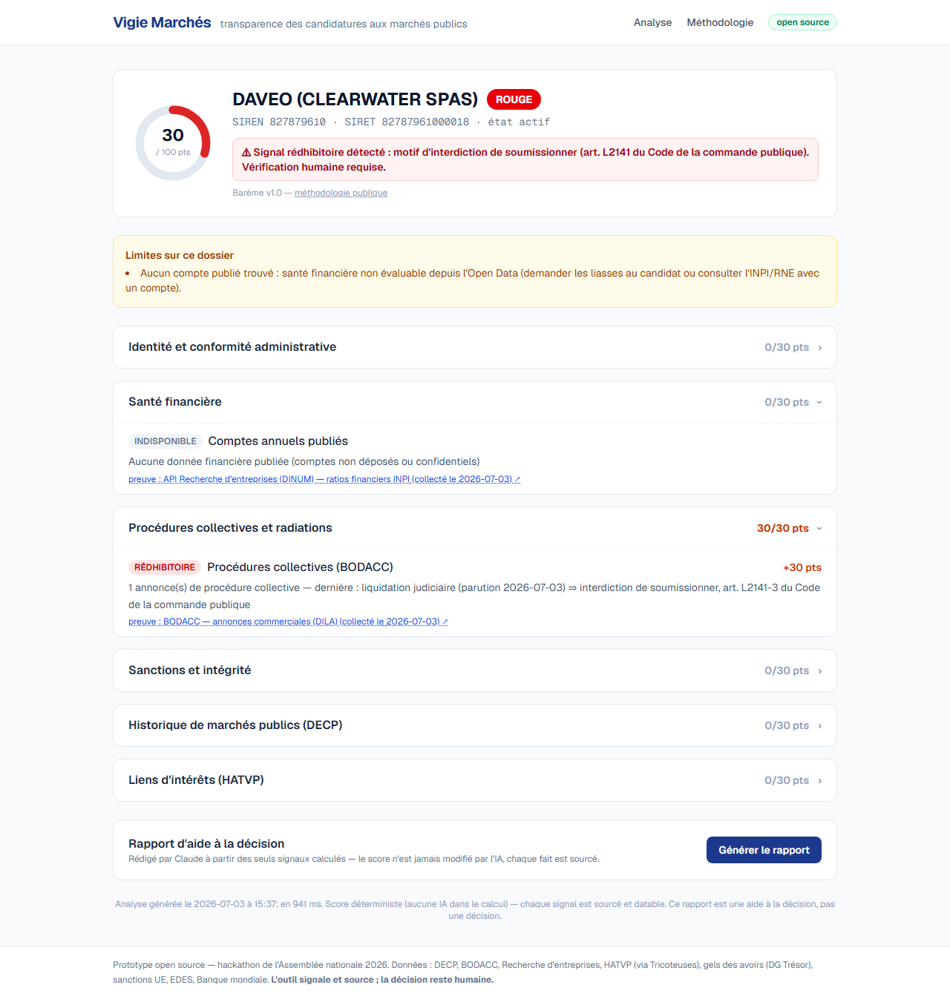

# Vigie Marchés

**L'IA et l'Open Data au service de la transparence des marchés publics.**
Prototype **open source** (hackathon de l'Assemblée nationale 2026) qui assiste les acheteurs
publics dans l'analyse des candidatures : il agrège les données ouvertes, vérifie la conformité
d'un candidat, produit un **score de risque explicable** et un **rapport d'aide à la décision** —
avec, derrière chaque signal, sa source et sa date. *L'outil signale et source ; la décision reste humaine.*



## Pourquoi

Vérifier un candidat impose aujourd'hui de consulter manuellement l'INPI, le BODACC, data.gouv,
les listes de sanctions… C'est chronophage et difficile à maintenir. Et **il n'existe aucun
registre public français des interdictions de soumissionner** (art. L2141 du Code de la commande
publique) : la vérification repose largement sur la déclaration sur l'honneur. Vigie Marchés
croise les signaux ouverts pour objectiver ce risque, sans se substituer au jugement de l'acheteur.

## Architecture

```
                    SOURCES OUVERTES (vérifiées, datées, licenciées)
   Recherche d'entreprises · BODACC · DECP (3,1 M) · Gels/UE/EDES/Banque mondiale · HATVP · Canutes
                                        │
              ┌─────────────────────────┼──────────────────────────┐
              ▼                          ▼                          ▼
      ingestion/ (batch)         clients.py (à la demande,     _provenance
   → data/vigie.duckdb           par candidat)                 (traçabilité)
              │                          │
              └───────────┬──────────────┘
                          ▼
                 vigie/  — MOTEUR DÉTERMINISTE (aucune IA)
        6 familles de signaux → barème v1.0 → Analyse JSON 100 % sourcée
                          │
        ┌─────────────────┼──────────────────┬────────────────────┐
        ▼                 ▼                  ▼                    ▼
   vigie/cli.py       api/ (FastAPI)     vigie_mcp/          vigie/rapport.py
   ligne de           7 endpoints        serveur MCP         rapport rédigé
   commande           REST + OpenAPI     5 outils agent.     par Claude*
                          │
                          ▼
                    front/ (Next.js) — recherche, fiche d'analyse, méthodologie

   * l'IA ne reçoit QUE le JSON du moteur : elle met en forme, ne calcule jamais le score.
```

Le cœur `vigie/` est écrit une fois et réutilisé par la CLI, l'API, le serveur MCP et le rapport —
un seul barème, un seul contrat JSON, une seule logique.

## Les 6 familles de signaux

| Famille | Source | Ce qu'elle détecte |
|---|---|---|
| Identité / conformité | Recherche d'entreprises | Existence, état cessé, ancienneté |
| Santé financière | Recherche d'entreprises (INPI) | Comptes absents/anciens, résultat négatif, CA en baisse |
| Procédures collectives | **BODACC** | Liquidation (rédhibitoire), redressement, radiation |
| Sanctions / intégrité | Gels des avoirs, UE, EDES, Banque mondiale | Correspondance de nom → toujours « à vérifier » |
| Historique de marchés | **DECP** (3,1 M) | Volume, montants, offre unique récurrente, concentration |
| Liens d'intérêts | **HATVP** | Inscription au registre du lobbying (informatif) |

Barème public et versionné (v1.0), aligné sur les interdictions de soumissionner : gravités
`info`/`mineur`/`majeur`/`redhibitoire`, points plafonnés par famille, niveaux **VERT / ORANGE / ROUGE**.
Règle absolue : **aucun signal sans preuve** (source, URL, date, licence).

## Démarrage rapide

### Option A — Docker (recommandé, tout-en-un)

Prérequis : Docker Desktop. Une seule commande construit les images, ingère les données et démarre tout :

```bash
docker compose up --build
#   Front  : http://localhost:3000
#   API    : http://localhost:8000/docs
```

Le service `ingest` construit la base **une seule fois** dans un volume (relancer avec
`FORCE_INGEST=1` pour rafraîchir). Par défaut, les DECP sont interrogées à distance (léger, rapide) ;
pour une base 100 % locale, mettre `INGEST_ARGS=" "` dans `.env`. Si le port 3000 est déjà pris,
`FRONT_PORT=3100 docker compose up --build`. Configuration : copier [`.env.example`](.env.example) en `.env`.

### Option B — Local (développement)

```powershell
# 1. Environnement Python + données (base DuckDB régénérable)
python -m venv .venv
.\.venv\Scripts\pip install -r requirements.txt
.\.venv\Scripts\python -m ingestion.ingest_all --decp-remote   # ~3 min, rien de lourd à télécharger

# 2. Le moteur en CLI (démonstration immédiate, sans serveur)
.\.venv\Scripts\python -m vigie.cli 827879610                   # DAVEO : ROUGE rédhibitoire

# 3. L'API   (terminal 1)                    # 4. Le front (terminal 2)
.\.venv\Scripts\uvicorn api.main:app          cd front ; npm install ; npm run dev
#   http://127.0.0.1:8000/docs                #   http://localhost:3000
```

Démo **sans réseau** (jury) : lancer l'API avec `VIGIE_OFFLINE=1` (ou dans `.env` pour Docker) — les 3 cas
sont servis depuis `data/fixtures/` (régénérables via `python scripts/generer_fixtures.py`).

Rapport IA (optionnel) : renseigner `ANTHROPIC_API_KEY` dans `.env`. Sans clé, tout fonctionne ;
seul le bouton « Générer le rapport » renvoie un message explicite.

## Cas de démonstration (données réelles, [détail](data/fixtures/cas_demo.md))

| Identifiant | Résultat | Intérêt |
|---|---|---|
| `552032534` (DANONE) | 🟢 VERT | Saine, mais détectée au registre HATVP du lobbying |
| `75058171200015` (NEOLEDGE) | 🟢 VERT | 74 marchés publics restitués en une requête (DECP) |
| `827879610` (DAVEO) | 🔴 ROUGE | « Active » au répertoire, mais en liquidation au BODACC |

## Serveurs MCP

[.mcp.json](.mcp.json) déclare 5 serveurs : notre serveur maison **`vigie`** (5 outils exposant
le moteur à un agent IA — `analyser_candidat`, `screening_sanctions`, `track_record_marches`,
`rechercher_entreprise`, `sources_donnees`) + 4 serveurs distants sans clé (Parlement/Tricoteuses,
data.gouv, JusticeLibre, service-public). Aucun serveur MCP dédié aux marchés publics n'existait.

## Structure du dépôt

```
vigie/          cœur : modeles, bareme, db, signaux/, moteur, cli, rapport
api/            FastAPI : main, schemas, cache
front/          Next.js : recherche, fiche d'analyse, méthodologie
vigie_mcp/      serveur MCP (FastMCP, stdio)
ingestion/      collecte Open Data → data/vigie.duckdb (+ clients à la demande)
scripts/        fixtures, slides, captures, smoke test
tests/          tests unitaires du moteur (partie pure, sans réseau)
docs/           SOURCES.md (inventaire vérifié), ROADMAP.md
hackathon-an-2026/   dossier réglementaire (DEFI.md, docs/, images/)
```

## Limites connues (assumées)

- **Homonymies sur les sanctions** : matching de noms, jamais de SIREN sur ces listes → statut
  « à vérifier » systématique, similarité et source affichées. L'outil ne conclut pas.
- **Qualité des DECP** : données déclaratives ; les anomalies ne sont évaluées qu'à partir de
  5 marchés, montants et taux affichés avec réserve.
- **Trous de données** : un compte non publié est « indisponible » (0 point, mais visible), pas « OK ».
- **Licence des données** : les miroirs OpenSanctions sont en CC-BY-NC 4.0 (usage non commercial) ;
  un déploiement commercial utiliserait les sources primaires libres (DG Trésor, UE, EDES).

## Tests

```powershell
.\.venv\Scripts\pip install -r requirements-dev.txt
.\.venv\Scripts\python -m pytest        # 32 tests, sans réseau ni base :
#   test_moteur   — barème, matching sanctions, agrégation des niveaux (partie pure)
#   test_imports  — tous les modules s'importent (dépendances complètes)
#   test_api      — contrat de l'API en mode hors-ligne (fixtures des 3 cas)

.\scripts\test-sources.ps1               # optionnel : les sources ouvertes répondent (14 vérifications, réseau requis)
```

Les tests ne nécessitent ni réseau ni base ingérée : ils valident la reproductibilité sur un poste vierge.

## Licence

Code sous licence [MIT](LICENSE). Données open data sous leurs licences respectives (créditées
dans le fichier LICENSE et sur la page Méthodologie). *Prototype de hackathon — la décision
d'admission ou d'exclusion d'un candidat appartient à l'acheteur public.*
